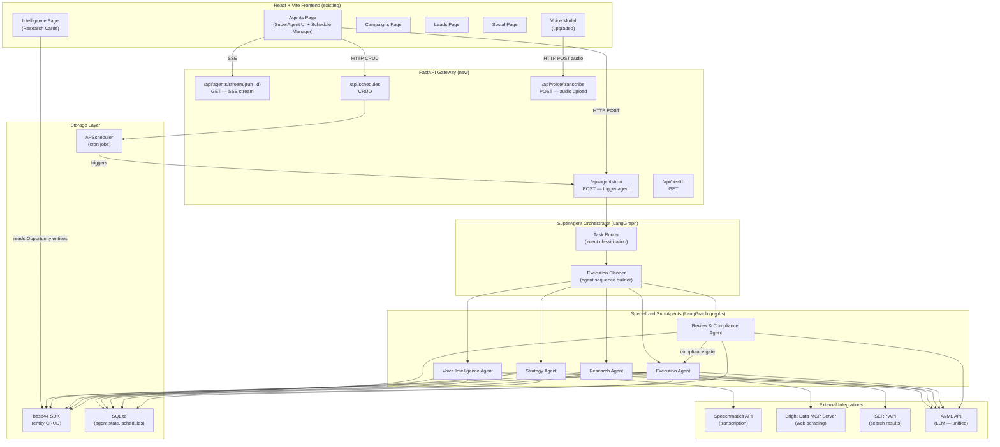
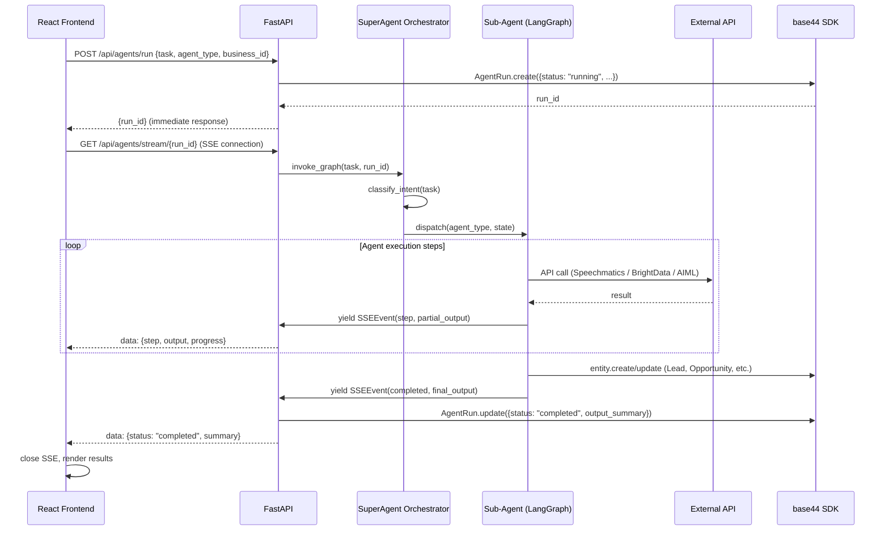
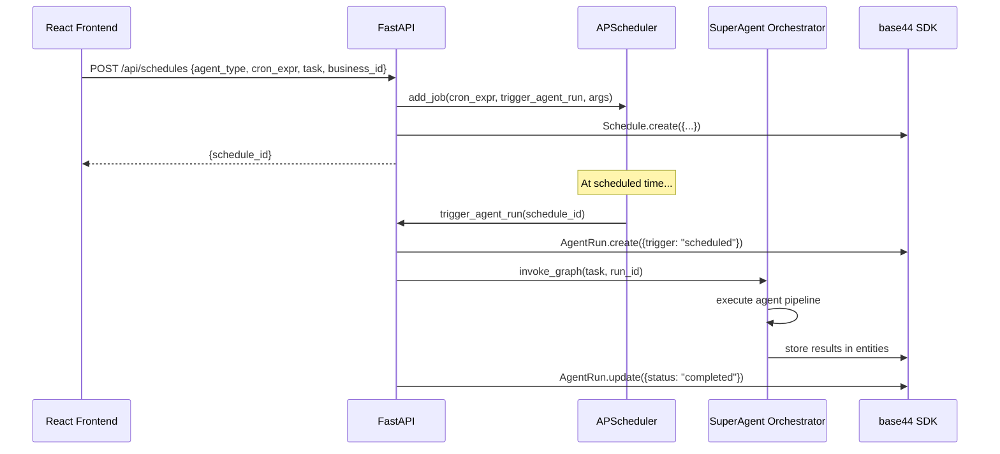

# Design Document: Orion SuperAgent Platform

## Overview

Orion SuperAgent is a multi-agent AI platform for small business owners that provides a personal AI team running 24/7. The platform extends an existing React + Vite frontend with a new Python backend built on FastAPI and LangGraph, introducing a SuperAgent orchestrator that delegates to five specialized sub-agents: Voice Intelligence, Research, Strategy, Execution, and Review & Compliance. Users interact via natural language tasks or preset automation templates; agents run on-demand or on cron schedules, streaming real-time progress back to the UI via Server-Sent Events.

The architecture is designed for hackathon scope (SQLite, APScheduler in-process) while being explicitly structured for production upgrade paths (Celery + Redis, PostgreSQL, distributed workers). The existing base44 SDK entity layer (Lead, Opportunity, AgentRun, Campaign, SocialPost, Business) is preserved and extended with two new entities: `Schedule` and `IntelligenceCard`.

---

## Part 1: High-Level Design

### 1.1 System Architecture




### 1.2 Data Flow: On-Demand Agent Run



### 1.3 Data Flow: Scheduled Agent Run




### 1.4 Components and Interfaces

#### SuperAgent Orchestrator

**Purpose**: Receives natural language tasks or preset template IDs, classifies intent, builds an agent execution plan, and dispatches to sub-agents in sequence.

**Interface**:
```typescript
interface OrchestratorInput {
  task: string                    // natural language or preset ID
  business_id: string
  run_id: string
  context?: BusinessContext       // optional pre-loaded business data
}

interface OrchestratorOutput {
  plan: AgentStep[]               // ordered list of agents to invoke
  results: AgentResult[]
  final_summary: string
}

interface AgentStep {
  agent_type: AgentType
  input: Record<string, unknown>
  depends_on?: string[]           // step IDs this step waits for
}
```

**Responsibilities**:
- Intent classification via LLM (maps task → agent sequence)
- Preset template resolution (e.g., "Track competitors every Monday" → Research Agent + Schedule)
- Sequential agent dispatch with state passing between steps
- Aggregating final summary for AgentRun entity

#### Voice Intelligence Agent

**Purpose**: Captures audio from browser microphone, transcribes via Speechmatics, extracts structured business records (leads, opportunities, follow-ups), and generates post-call summaries.

**Interface**:
```typescript
interface VoiceAgentInput {
  audio_blob: Blob | string       // raw audio or base64
  call_type: "sales" | "supplier" | "customer"
  business_id: string
}

interface VoiceAgentOutput {
  transcript: string
  extracted_leads: Lead[]
  extracted_opportunities: Opportunity[]
  follow_up_actions: FollowUpAction[]
  call_summary: string
}
```

#### Research Agent

**Purpose**: Collects competitor and market intelligence from public web sources using Bright Data MCP Server, SERP API, and Web Unlocker. Outputs structured IntelligenceCard entities.

**Interface**:
```typescript
interface ResearchAgentInput {
  business_id: string
  business_type: string
  city: string
  competitors: string[]
  research_topics: ResearchTopic[]  // ["pricing", "reviews", "promotions"]
}

interface ResearchAgentOutput {
  intelligence_cards: IntelligenceCard[]
  opportunities: Opportunity[]
  raw_sources: string[]
}
```

#### Strategy Agent

**Purpose**: Reviews aggregated business data and market intelligence, applies LLM reasoning to produce prioritized recommendations, and queues approved actions for the Execution Agent.

**Interface**:
```typescript
interface StrategyAgentInput {
  business_id: string
  leads: Lead[]
  opportunities: Opportunity[]
  recent_agent_runs: AgentRun[]
  intelligence_cards: IntelligenceCard[]
}

interface StrategyAgentOutput {
  recommendations: StrategyRecommendation[]
  queued_actions: ExecutionAction[]
  reasoning_summary: string
}
```

#### Execution Agent

**Purpose**: Converts approved strategy actions into concrete deliverables — broadcast messages, payment links, listing updates, follow-up drafts — and reports outcomes.

**Interface**:
```typescript
interface ExecutionAgentInput {
  actions: ExecutionAction[]
  business_id: string
  run_id: string
}

interface ExecutionAgentOutput {
  completed_actions: CompletedAction[]
  created_campaigns: Campaign[]
  created_social_posts: SocialPost[]
  outcome_summary: string
}
```

#### Review & Compliance Agent

**Purpose**: Acts as a gate before any outgoing content is finalized. Checks for risky claims, misleading pricing, spam patterns, and reputational issues. Maintains an audit trail.

**Interface**:
```typescript
interface ComplianceAgentInput {
  content_items: ContentItem[]    // campaigns, posts, messages to review
  business_id: string
  run_id: string
}

interface ComplianceAgentOutput {
  approved: ContentItem[]
  flagged: FlaggedItem[]
  audit_entries: AuditEntry[]
}

interface FlaggedItem {
  content_id: string
  reason: string
  severity: "low" | "medium" | "high" | "block"
  suggested_fix: string
}
```


### 1.5 Entity Model — Additions and Extensions

#### New Entity: Schedule

```typescript
interface Schedule {
  id: string
  business_id: string
  agent_type: AgentType
  task_description: string
  cron_expression: string         // e.g. "0 9 * * 1" (Monday 9am)
  is_active: boolean
  last_run_at?: string            // ISO datetime
  next_run_at?: string            // ISO datetime
  run_count: number
  created_date: string
}
```

#### New Entity: IntelligenceCard

```typescript
interface IntelligenceCard {
  id: string
  business_id: string
  agent_run_id: string
  card_type: "competitor" | "pricing" | "review" | "promotion" | "trend" | "brand_mention"
  title: string
  summary: string
  source_url: string
  source_name: string
  raw_data: string
  sentiment?: "positive" | "neutral" | "negative"
  relevance_score: number         // 1-10
  created_date: string
}
```

#### Extended Entity: AgentRun (additions)

```typescript
// New fields added to existing AgentRun entity
interface AgentRunExtensions {
  agent_type: AgentType           // extended enum (see below)
  streaming_log: string[]         // SSE step log for replay
  compliance_flags: string[]      // flags raised by Review Agent
  schedule_id?: string            // if triggered by a schedule
  parent_run_id?: string          // if spawned by orchestrator
}

// Extended AgentType enum
type AgentType =
  | "market_intelligence"         // existing
  | "marketing"                   // existing
  | "sales"                       // existing
  | "social_media"                // existing
  | "voice_chat"                  // existing
  | "orchestrator"                // existing
  | "voice_intelligence"          // NEW
  | "research"                    // NEW
  | "strategy"                    // NEW
  | "execution"                   // NEW
  | "review_compliance"           // NEW
```

### 1.6 Frontend Integration Points

The existing frontend calls `base44.integrations.Core.InvokeLLM` directly. The upgrade path replaces these calls with FastAPI endpoints while keeping the base44 entity SDK for data persistence.

| Existing Pattern | New Pattern |
|---|---|
| `base44.integrations.Core.InvokeLLM({prompt})` | `POST /api/agents/run {task, agent_type}` |
| Polling for results | SSE stream `GET /api/agents/stream/{run_id}` |
| `base44.entities.AgentRun.create(...)` | Backend creates AgentRun; frontend reads via base44 SDK |
| Browser SpeechRecognition API | `POST /api/voice/transcribe` with audio blob |
| No scheduling | `POST /api/schedules` + Schedule Manager UI |

New React components needed:
- `SuperAgentPanel` — natural language task input + preset cards
- `AgentStreamViewer` — SSE consumer showing real-time step output
- `ScheduleManager` — CRUD UI for schedules (embedded in Agents page)
- `VoiceModal` upgrade — sends audio to `/api/voice/transcribe` instead of browser API


### 1.7 Error Handling

#### Agent Execution Failure

**Condition**: A sub-agent raises an unhandled exception or an external API returns an error.
**Response**: LangGraph catches the exception at the node boundary; the orchestrator emits an SSE error event with the step name and message.
**Recovery**: AgentRun is updated to `status: "failed"` with `error_message`. Partial results already written to entities are preserved. The frontend shows the error inline in the stream viewer.

#### External API Unavailability (Bright Data / Speechmatics)

**Condition**: HTTP 5xx or timeout from external integration.
**Response**: Agent retries up to 2 times with exponential backoff (1s, 3s). On final failure, the agent node returns a degraded result with `source: "unavailable"`.
**Recovery**: Research Agent falls back to cached IntelligenceCards from the last successful run. Voice Agent returns partial transcript if available.

#### Compliance Block

**Condition**: Review & Compliance Agent flags content with `severity: "block"`.
**Response**: Execution Agent is halted for that content item. An audit entry is written. The SSE stream emits a `compliance_blocked` event.
**Recovery**: The flagged item is stored with `status: "pending_review"` for manual human review. Other non-blocked items continue to execute.

#### Schedule Missed Run

**Condition**: APScheduler misses a scheduled trigger (e.g., server was down).
**Response**: APScheduler `misfire_grace_time` is set to 300s. If within grace period, the job fires immediately on restart.
**Recovery**: Schedule entity `last_run_at` is updated; `next_run_at` is recalculated. A missed-run AgentRun record is created with `status: "failed"` and `error_message: "missed_schedule"`.

### 1.8 Security Considerations

- All FastAPI endpoints validate `business_id` against the authenticated user's session (JWT from base44 auth).
- Speechmatics audio uploads are streamed directly to the Speechmatics API; audio is never persisted to disk.
- Bright Data credentials and API keys are stored in environment variables, never in code or entities.
- The Review & Compliance Agent acts as a mandatory gate — it cannot be bypassed by the Execution Agent.
- SSE streams are scoped to `run_id`; a user can only subscribe to runs belonging to their `business_id`.
- SQLite WAL mode is enabled to prevent data corruption during concurrent agent runs.

### 1.9 Performance Considerations

- LangGraph graphs are compiled once at startup and reused across requests (no per-request compilation overhead).
- SSE connections are managed with `asyncio` — each stream is a lightweight async generator, not a thread.
- Bright Data scraping calls are parallelized within the Research Agent using `asyncio.gather`.
- APScheduler uses the `AsyncIOScheduler` variant to avoid blocking the FastAPI event loop.
- For hackathon scope, a single FastAPI process handles all agents. The architecture supports horizontal scaling by moving to Celery workers with Redis as the broker.

### 1.10 Dependencies

| Dependency | Version | Purpose |
|---|---|---|
| `fastapi` | `^0.115` | REST API framework |
| `uvicorn[standard]` | `^0.32` | ASGI server with SSE support |
| `langgraph` | `^0.2` | Agent graph orchestration |
| `langchain-core` | `^0.3` | LangChain base primitives |
| `langchain-mcp-adapters` | `^0.1` | Bright Data MCP Server integration |
| `langchain-openai` | `^0.2` | AI/ML API (OpenAI-compatible) |
| `apscheduler` | `^3.10` | In-process cron scheduling |
| `httpx` | `^0.27` | Async HTTP client (Speechmatics, SERP) |
| `python-multipart` | `^0.0.12` | Audio file upload handling |
| `pydantic` | `^2.9` | Request/response validation |
| `sqlalchemy` | `^2.0` | SQLite ORM for local state |
| `python-dotenv` | `^1.0` | Environment variable management |
| `sse-starlette` | `^2.1` | SSE response helper for FastAPI |


---

## Part 2: Low-Level Design

### 2.1 Backend Directory Structure

```
backend/
├── main.py                        # FastAPI app entry point
├── config.py                      # Settings (env vars, constants)
├── database.py                    # SQLAlchemy SQLite setup
├── models/
│   ├── schedule.py                # SQLAlchemy Schedule model
│   └── agent_state.py             # SQLAlchemy AgentState model
├── routers/
│   ├── agents.py                  # /api/agents/* endpoints
│   ├── schedules.py               # /api/schedules/* endpoints
│   └── voice.py                   # /api/voice/* endpoints
├── agents/
│   ├── orchestrator.py            # SuperAgent orchestrator graph
│   ├── voice_intelligence.py      # Voice Intelligence Agent graph
│   ├── research.py                # Research Agent graph
│   ├── strategy.py                # Strategy Agent graph
│   ├── execution.py               # Execution Agent graph
│   └── review_compliance.py       # Review & Compliance Agent graph
├── integrations/
│   ├── speechmatics.py            # Speechmatics API client
│   ├── bright_data.py             # Bright Data MCP + SERP client
│   ├── aiml_api.py                # AI/ML API LLM wrapper
│   └── base44_bridge.py           # base44 entity write helpers
├── scheduler/
│   └── setup.py                   # APScheduler initialization
└── schemas/
    ├── agent.py                   # Pydantic request/response schemas
    ├── schedule.py                # Schedule schemas
    └── voice.py                   # Voice schemas
```

### 2.2 FastAPI Endpoint Signatures

```python
# routers/agents.py

from fastapi import APIRouter, BackgroundTasks, Depends
from fastapi.responses import StreamingResponse
from schemas.agent import AgentRunRequest, AgentRunResponse
from agents.orchestrator import run_orchestrator

router = APIRouter(prefix="/api/agents", tags=["agents"])

@router.post("/run", response_model=AgentRunResponse)
async def trigger_agent_run(
    request: AgentRunRequest,
    background_tasks: BackgroundTasks,
) -> AgentRunResponse:
    """
    Trigger an agent run. Returns run_id immediately.
    Client should then open SSE stream at /stream/{run_id}.
    
    Preconditions:
    - request.business_id is non-empty
    - request.agent_type is a valid AgentType enum value
    - request.task is non-empty string
    
    Postconditions:
    - AgentRun entity created in base44 with status="running"
    - Background task queued for agent execution
    - Returns run_id for SSE subscription
    """
    ...

@router.get("/stream/{run_id}")
async def stream_agent_run(
    run_id: str,
    business_id: str,
) -> StreamingResponse:
    """
    SSE stream for a running agent. Emits step events until completion.
    
    Event types: step_start, step_complete, tool_call, tool_result,
                 compliance_flag, completed, error
    
    Preconditions:
    - run_id exists and belongs to business_id
    
    Postconditions:
    - Streams SSE events until agent completes or errors
    - Final event has type="completed" or type="error"
    """
    ...

@router.get("/runs")
async def list_agent_runs(
    business_id: str,
    limit: int = 20,
    agent_type: str | None = None,
) -> list[AgentRunResponse]:
    """Fetch recent AgentRun records from base44."""
    ...
```

```python
# routers/schedules.py

from fastapi import APIRouter
from schemas.schedule import ScheduleCreate, ScheduleResponse, ScheduleUpdate

router = APIRouter(prefix="/api/schedules", tags=["schedules"])

@router.post("/", response_model=ScheduleResponse)
async def create_schedule(body: ScheduleCreate) -> ScheduleResponse:
    """
    Create a new agent schedule.
    Registers the cron job with APScheduler and persists to SQLite + base44.
    
    Preconditions:
    - body.cron_expression is a valid 5-field cron string
    - body.agent_type is a valid AgentType
    
    Postconditions:
    - APScheduler job registered with job_id = schedule.id
    - Schedule record created in SQLite
    - Schedule entity created in base44
    """
    ...

@router.get("/", response_model=list[ScheduleResponse])
async def list_schedules(business_id: str) -> list[ScheduleResponse]:
    """List all schedules for a business."""
    ...

@router.patch("/{schedule_id}", response_model=ScheduleResponse)
async def update_schedule(
    schedule_id: str,
    body: ScheduleUpdate,
) -> ScheduleResponse:
    """Enable/disable or update cron expression. Syncs APScheduler job."""
    ...

@router.delete("/{schedule_id}", status_code=204)
async def delete_schedule(schedule_id: str) -> None:
    """Remove schedule from APScheduler and SQLite."""
    ...
```

```python
# routers/voice.py

from fastapi import APIRouter, UploadFile, File, Form

router = APIRouter(prefix="/api/voice", tags=["voice"])

@router.post("/transcribe")
async def transcribe_audio(
    audio: UploadFile = File(...),
    business_id: str = Form(...),
    call_type: str = Form("customer"),
) -> dict:
    """
    Upload audio file, transcribe via Speechmatics, extract structured data.
    
    Preconditions:
    - audio is a valid audio file (wav, mp3, webm, ogg)
    - audio size <= 100MB
    
    Postconditions:
    - Returns transcript, extracted_leads, extracted_opportunities,
      follow_up_actions, call_summary
    - Lead and Opportunity entities created in base44
    - AgentRun entity created with agent_type="voice_intelligence"
    """
    ...
```


### 2.3 Pydantic Schemas

```python
# schemas/agent.py

from pydantic import BaseModel, Field
from enum import Enum
from typing import Any

class AgentType(str, Enum):
    ORCHESTRATOR = "orchestrator"
    VOICE_INTELLIGENCE = "voice_intelligence"
    RESEARCH = "research"
    STRATEGY = "strategy"
    EXECUTION = "execution"
    REVIEW_COMPLIANCE = "review_compliance"
    # Legacy types (existing frontend compatibility)
    MARKET_INTELLIGENCE = "market_intelligence"
    MARKETING = "marketing"
    SALES = "sales"
    SOCIAL_MEDIA = "social_media"

class AgentRunRequest(BaseModel):
    business_id: str = Field(..., min_length=1)
    agent_type: AgentType = Field(default=AgentType.ORCHESTRATOR)
    task: str = Field(..., min_length=1, max_length=2000)
    preset_id: str | None = None
    context: dict[str, Any] | None = None

class AgentRunResponse(BaseModel):
    run_id: str
    status: str
    agent_type: AgentType
    created_at: str

class SSEEvent(BaseModel):
    event_type: str   # step_start | step_complete | tool_call | tool_result
                      # compliance_flag | completed | error
    step_name: str | None = None
    message: str
    data: dict[str, Any] | None = None
    progress: int | None = None   # 0-100
```

```python
# schemas/schedule.py

from pydantic import BaseModel, Field
from agents.schemas import AgentType

class ScheduleCreate(BaseModel):
    business_id: str = Field(..., min_length=1)
    agent_type: AgentType
    task_description: str = Field(..., min_length=1)
    cron_expression: str = Field(
        ...,
        pattern=r"^(\*|[0-9,\-\*/]+)\s+(\*|[0-9,\-\*/]+)\s+(\*|[0-9,\-\*/]+)\s+(\*|[0-9,\-\*/]+)\s+(\*|[0-9,\-\*/]+)$"
    )
    is_active: bool = True

class ScheduleUpdate(BaseModel):
    is_active: bool | None = None
    cron_expression: str | None = None
    task_description: str | None = None

class ScheduleResponse(ScheduleCreate):
    id: str
    last_run_at: str | None
    next_run_at: str | None
    run_count: int
    created_at: str
```

### 2.4 LangGraph Graph Definitions

#### 2.4.1 SuperAgent Orchestrator Graph

```python
# agents/orchestrator.py

from langgraph.graph import StateGraph, END
from typing import TypedDict, Annotated
import operator

class OrchestratorState(TypedDict):
    task: str
    business_id: str
    run_id: str
    business_context: dict
    intent: str                          # classified intent
    agent_plan: list[dict]               # ordered agent steps
    current_step_index: int
    step_results: Annotated[list, operator.add]
    final_summary: str
    error: str | None

def build_orchestrator_graph() -> StateGraph:
    graph = StateGraph(OrchestratorState)

    # Nodes
    graph.add_node("load_context", load_business_context)
    graph.add_node("classify_intent", classify_intent_node)
    graph.add_node("build_plan", build_execution_plan_node)
    graph.add_node("dispatch_agent", dispatch_next_agent_node)
    graph.add_node("aggregate_results", aggregate_results_node)

    # Edges
    graph.set_entry_point("load_context")
    graph.add_edge("load_context", "classify_intent")
    graph.add_edge("classify_intent", "build_plan")
    graph.add_edge("build_plan", "dispatch_agent")
    graph.add_conditional_edges(
        "dispatch_agent",
        should_continue_dispatch,
        {
            "continue": "dispatch_agent",   # more agents in plan
            "done": "aggregate_results",
        }
    )
    graph.add_edge("aggregate_results", END)

    return graph.compile()

# Intent → Agent Plan mapping
PRESET_PLANS = {
    "find_new_clients": [
        {"agent": "research", "focus": "lead_sources"},
        {"agent": "strategy", "focus": "lead_generation"},
        {"agent": "review_compliance", "scope": "outreach_content"},
        {"agent": "execution", "actions": ["create_campaign", "draft_outreach"]},
    ],
    "track_competitors": [
        {"agent": "research", "focus": "competitor_monitoring"},
    ],
    "prepare_tax_season": [
        {"agent": "strategy", "focus": "financial_review"},
        {"agent": "execution", "actions": ["generate_report"]},
    ],
}
```


#### 2.4.2 Research Agent Graph

```python
# agents/research.py

from langgraph.graph import StateGraph, END
from typing import TypedDict, Annotated
import operator

class ResearchState(TypedDict):
    business_id: str
    run_id: str
    business_type: str
    city: str
    competitors: list[str]
    research_topics: list[str]
    search_queries: list[str]           # generated by LLM
    raw_results: Annotated[list, operator.add]
    intelligence_cards: Annotated[list, operator.add]
    opportunities: Annotated[list, operator.add]
    error: str | None

def build_research_graph() -> StateGraph:
    graph = StateGraph(ResearchState)

    graph.add_node("generate_queries", generate_search_queries_node)
    graph.add_node("serp_search", serp_search_node)           # SERP API
    graph.add_node("scrape_pages", scrape_pages_node)         # Bright Data Web Unlocker
    graph.add_node("extract_intelligence", extract_intelligence_node)  # LLM extraction
    graph.add_node("create_opportunities", create_opportunities_node)  # LLM scoring
    graph.add_node("persist_results", persist_research_results_node)   # base44 writes

    graph.set_entry_point("generate_queries")
    graph.add_edge("generate_queries", "serp_search")
    graph.add_edge("serp_search", "scrape_pages")
    graph.add_edge("scrape_pages", "extract_intelligence")
    graph.add_edge("extract_intelligence", "create_opportunities")
    graph.add_edge("create_opportunities", "persist_results")
    graph.add_edge("persist_results", END)

    return graph.compile()
```

#### 2.4.3 Voice Intelligence Agent Graph

```python
# agents/voice_intelligence.py

from langgraph.graph import StateGraph, END
from typing import TypedDict

class VoiceState(TypedDict):
    business_id: str
    run_id: str
    audio_bytes: bytes
    audio_format: str                   # wav | mp3 | webm | ogg
    call_type: str                      # sales | supplier | customer
    transcript: str
    extracted_entities: dict            # raw LLM extraction
    leads: list[dict]
    opportunities: list[dict]
    follow_up_actions: list[dict]
    call_summary: str
    error: str | None

def build_voice_graph() -> StateGraph:
    graph = StateGraph(VoiceState)

    graph.add_node("transcribe", speechmatics_transcribe_node)
    graph.add_node("extract_entities", extract_entities_node)   # LLM structured extraction
    graph.add_node("classify_leads", classify_leads_node)       # LLM lead scoring
    graph.add_node("generate_summary", generate_summary_node)   # LLM summary
    graph.add_node("persist_entities", persist_voice_entities_node)  # base44 writes

    graph.set_entry_point("transcribe")
    graph.add_edge("transcribe", "extract_entities")
    graph.add_edge("extract_entities", "classify_leads")
    graph.add_edge("classify_leads", "generate_summary")
    graph.add_edge("generate_summary", "persist_entities")
    graph.add_edge("persist_entities", END)

    return graph.compile()
```

#### 2.4.4 Strategy Agent Graph

```python
# agents/strategy.py

from langgraph.graph import StateGraph, END
from typing import TypedDict, Annotated
import operator

class StrategyState(TypedDict):
    business_id: str
    run_id: str
    business_data: dict                 # leads, opportunities, campaigns
    intelligence_cards: list[dict]
    recent_runs: list[dict]
    analysis: str                       # LLM analysis output
    recommendations: Annotated[list, operator.add]
    queued_actions: Annotated[list, operator.add]
    reasoning_summary: str
    error: str | None

def build_strategy_graph() -> StateGraph:
    graph = StateGraph(StrategyState)

    graph.add_node("load_business_data", load_business_data_node)
    graph.add_node("analyze_market_position", analyze_market_position_node)  # LLM
    graph.add_node("generate_recommendations", generate_recommendations_node)  # LLM
    graph.add_node("prioritize_actions", prioritize_actions_node)  # LLM scoring
    graph.add_node("queue_for_execution", queue_for_execution_node)

    graph.set_entry_point("load_business_data")
    graph.add_edge("load_business_data", "analyze_market_position")
    graph.add_edge("analyze_market_position", "generate_recommendations")
    graph.add_edge("generate_recommendations", "prioritize_actions")
    graph.add_edge("prioritize_actions", "queue_for_execution")
    graph.add_edge("queue_for_execution", END)

    return graph.compile()
```

#### 2.4.5 Review & Compliance Agent Graph

```python
# agents/review_compliance.py

from langgraph.graph import StateGraph, END
from typing import TypedDict, Annotated
import operator

class ComplianceState(TypedDict):
    business_id: str
    run_id: str
    content_items: list[dict]           # campaigns, posts, messages
    approved: Annotated[list, operator.add]
    flagged: Annotated[list, operator.add]
    audit_entries: Annotated[list, operator.add]
    error: str | None

def build_compliance_graph() -> StateGraph:
    graph = StateGraph(ComplianceState)

    graph.add_node("check_claims", check_claims_node)           # LLM: risky claims
    graph.add_node("check_pricing", check_pricing_node)         # LLM: misleading pricing
    graph.add_node("check_spam", check_spam_patterns_node)      # rule-based + LLM
    graph.add_node("check_reputation", check_reputation_node)   # LLM: brand risk
    graph.add_node("write_audit", write_audit_trail_node)       # base44 AgentRun update

    graph.set_entry_point("check_claims")
    graph.add_edge("check_claims", "check_pricing")
    graph.add_edge("check_pricing", "check_spam")
    graph.add_edge("check_spam", "check_reputation")
    graph.add_edge("check_reputation", "write_audit")
    graph.add_edge("write_audit", END)

    return graph.compile()
```

#### 2.4.6 Execution Agent Graph

```python
# agents/execution.py

from langgraph.graph import StateGraph, END
from typing import TypedDict, Annotated
import operator

class ExecutionState(TypedDict):
    business_id: str
    run_id: str
    approved_actions: list[dict]        # from compliance agent
    created_campaigns: Annotated[list, operator.add]
    created_social_posts: Annotated[list, operator.add]
    completed_actions: Annotated[list, operator.add]
    outcome_summary: str
    error: str | None

def build_execution_graph() -> StateGraph:
    graph = StateGraph(ExecutionState)

    graph.add_node("route_actions", route_actions_node)         # fan-out by action type
    graph.add_node("create_campaigns", create_campaigns_node)   # base44 Campaign.create
    graph.add_node("create_social_posts", create_posts_node)    # base44 SocialPost.create
    graph.add_node("draft_messages", draft_messages_node)       # LLM + base44
    graph.add_node("summarize_outcomes", summarize_outcomes_node)

    graph.set_entry_point("route_actions")
    graph.add_conditional_edges(
        "route_actions",
        route_to_action_handlers,
        {
            "campaign": "create_campaigns",
            "social": "create_social_posts",
            "message": "draft_messages",
        }
    )
    graph.add_edge("create_campaigns", "summarize_outcomes")
    graph.add_edge("create_social_posts", "summarize_outcomes")
    graph.add_edge("draft_messages", "summarize_outcomes")
    graph.add_edge("summarize_outcomes", END)

    return graph.compile()
```


### 2.5 SSE Streaming Pattern

```python
# routers/agents.py — SSE implementation

from sse_starlette.sse import EventSourceResponse
from asyncio import Queue
import asyncio

# Global run queue registry: run_id -> asyncio.Queue
_run_queues: dict[str, Queue] = {}

async def stream_agent_run(run_id: str, business_id: str):
    """
    SSE generator. Yields events from the run's queue until completion.
    
    Preconditions:
    - run_id exists in _run_queues (set up by trigger_agent_run)
    
    Postconditions:
    - Yields SSE events until a "completed" or "error" event is received
    - Queue is cleaned up after stream ends
    
    Loop Invariant:
    - Each iteration yields exactly one event from the queue
    - Queue is non-empty when the agent is actively running
    """
    queue = _run_queues.get(run_id)
    if not queue:
        yield {"event": "error", "data": '{"message": "run not found"}'}
        return

    try:
        while True:
            event: SSEEvent = await asyncio.wait_for(queue.get(), timeout=60.0)
            yield {
                "event": event.event_type,
                "data": event.model_dump_json(),
            }
            if event.event_type in ("completed", "error"):
                break
    finally:
        _run_queues.pop(run_id, None)

async def trigger_agent_run(request: AgentRunRequest, background_tasks: BackgroundTasks):
    run_id = await create_agent_run_in_base44(request)
    queue: Queue[SSEEvent] = Queue()
    _run_queues[run_id] = queue

    background_tasks.add_task(
        execute_agent_with_streaming,
        request=request,
        run_id=run_id,
        queue=queue,
    )
    return AgentRunResponse(run_id=run_id, status="running", ...)

async def execute_agent_with_streaming(
    request: AgentRunRequest,
    run_id: str,
    queue: Queue[SSEEvent],
):
    """
    Runs the LangGraph graph and pushes SSE events to the queue.
    
    Preconditions:
    - queue is initialized and run_id is registered
    
    Postconditions:
    - All graph node transitions emit a step_start event
    - All tool calls emit tool_call and tool_result events
    - Final state emits completed or error event
    - AgentRun entity updated in base44 on completion
    """
    try:
        graph = get_graph_for_agent_type(request.agent_type)
        async for event in graph.astream_events(
            input=build_graph_input(request, run_id),
            version="v2",
        ):
            sse_event = map_langgraph_event_to_sse(event)
            if sse_event:
                await queue.put(sse_event)

        await queue.put(SSEEvent(event_type="completed", message="Agent run complete"))
        await update_agent_run_in_base44(run_id, status="completed")
    except Exception as e:
        await queue.put(SSEEvent(event_type="error", message=str(e)))
        await update_agent_run_in_base44(run_id, status="failed", error_message=str(e))
```

### 2.6 Bright Data Integration Pattern

```python
# integrations/bright_data.py

from langchain_mcp_adapters.client import MultiServerMCPClient
from langchain_core.tools import BaseTool
import httpx

async def get_bright_data_tools() -> list[BaseTool]:
    """
    Initialize Bright Data MCP Server and return LangChain-compatible tools.
    
    Preconditions:
    - BRIGHT_DATA_API_TOKEN env var is set
    - MCP server is reachable
    
    Postconditions:
    - Returns list of tools: web_search, scrape_url, unlocker_request
    """
    client = MultiServerMCPClient({
        "bright_data": {
            "command": "npx",
            "args": ["@brightdata/mcp"],
            "env": {"API_TOKEN": settings.BRIGHT_DATA_API_TOKEN},
            "transport": "stdio",
        }
    })
    tools = await client.get_tools()
    return tools

async def serp_search(query: str, num_results: int = 10) -> list[dict]:
    """
    Search via SERP API (fallback when MCP is unavailable).
    
    Preconditions:
    - query is non-empty
    - SERP_API_KEY env var is set
    
    Postconditions:
    - Returns list of {title, url, snippet} dicts
    - Returns empty list on API error (graceful degradation)
    """
    async with httpx.AsyncClient() as client:
        response = await client.get(
            "https://serpapi.com/search",
            params={
                "q": query,
                "api_key": settings.SERP_API_KEY,
                "num": num_results,
                "engine": "google",
            },
            timeout=15.0,
        )
        response.raise_for_status()
        data = response.json()
        return [
            {"title": r.get("title"), "url": r.get("link"), "snippet": r.get("snippet")}
            for r in data.get("organic_results", [])
        ]
```

### 2.7 Speechmatics Integration Pattern

```python
# integrations/speechmatics.py

import httpx
import asyncio
from typing import AsyncGenerator

SPEECHMATICS_API_URL = "https://asr.api.speechmatics.com/v2"

async def transcribe_audio(
    audio_bytes: bytes,
    audio_format: str,
    language: str = "en",
) -> str:
    """
    Submit audio to Speechmatics batch transcription API and poll for result.
    
    Preconditions:
    - audio_bytes is non-empty
    - audio_format is one of: wav, mp3, webm, ogg, m4a
    - SPEECHMATICS_API_KEY env var is set
    
    Postconditions:
    - Returns full transcript string
    - Raises TranscriptionError on API failure after 2 retries
    
    Loop Invariant (polling loop):
    - Each iteration checks job status
    - Loop exits when status is "done" or "error"
    - Maximum 60 iterations (5 min timeout at 5s interval)
    """
    headers = {"Authorization": f"Bearer {settings.SPEECHMATICS_API_KEY}"}

    # Step 1: Submit job
    async with httpx.AsyncClient() as client:
        files = {"data_file": (f"audio.{audio_format}", audio_bytes, f"audio/{audio_format}")}
        config = {
            "type": "transcription",
            "transcription_config": {"language": language, "operating_point": "enhanced"},
        }
        response = await client.post(
            f"{SPEECHMATICS_API_URL}/jobs",
            headers=headers,
            files=files,
            data={"config": json.dumps(config)},
            timeout=30.0,
        )
        response.raise_for_status()
        job_id = response.json()["id"]

    # Step 2: Poll for completion
    for _ in range(60):
        await asyncio.sleep(5)
        async with httpx.AsyncClient() as client:
            status_resp = await client.get(
                f"{SPEECHMATICS_API_URL}/jobs/{job_id}",
                headers=headers,
            )
            job = status_resp.json()
            if job["job"]["status"] == "done":
                transcript_resp = await client.get(
                    f"{SPEECHMATICS_API_URL}/jobs/{job_id}/transcript",
                    headers=headers,
                    params={"format": "txt"},
                )
                return transcript_resp.text
            elif job["job"]["status"] == "error":
                raise TranscriptionError(f"Speechmatics job failed: {job}")

    raise TranscriptionError("Transcription timed out after 5 minutes")
```


### 2.8 APScheduler Setup

```python
# scheduler/setup.py

from apscheduler.schedulers.asyncio import AsyncIOScheduler
from apscheduler.triggers.cron import CronTrigger
from apscheduler.jobstores.sqlalchemy import SQLAlchemyJobStore
import logging

logger = logging.getLogger(__name__)

def create_scheduler(database_url: str) -> AsyncIOScheduler:
    """
    Initialize APScheduler with SQLite job store for persistence.
    
    Preconditions:
    - database_url is a valid SQLAlchemy connection string
    
    Postconditions:
    - Scheduler is configured with SQLite job store
    - misfire_grace_time = 300s (5 min tolerance for missed runs)
    - coalesce = True (run once if multiple misfires)
    - Returns scheduler (not yet started)
    """
    jobstores = {
        "default": SQLAlchemyJobStore(url=database_url)
    }
    job_defaults = {
        "coalesce": True,
        "max_instances": 1,
        "misfire_grace_time": 300,
    }
    scheduler = AsyncIOScheduler(
        jobstores=jobstores,
        job_defaults=job_defaults,
        timezone="UTC",
    )
    return scheduler

async def register_schedule(
    scheduler: AsyncIOScheduler,
    schedule_id: str,
    cron_expression: str,
    agent_type: str,
    task: str,
    business_id: str,
) -> None:
    """
    Register a new cron job with APScheduler.
    
    Preconditions:
    - schedule_id is unique
    - cron_expression is a valid 5-field cron string
    - scheduler is running
    
    Postconditions:
    - Job registered with id=schedule_id
    - Job will call trigger_scheduled_run(schedule_id, agent_type, task, business_id)
    - next_run_time is calculated from cron_expression
    """
    minute, hour, day, month, day_of_week = cron_expression.split()
    trigger = CronTrigger(
        minute=minute,
        hour=hour,
        day=day,
        month=month,
        day_of_week=day_of_week,
        timezone="UTC",
    )
    scheduler.add_job(
        trigger_scheduled_run,
        trigger=trigger,
        id=schedule_id,
        kwargs={
            "schedule_id": schedule_id,
            "agent_type": agent_type,
            "task": task,
            "business_id": business_id,
        },
        replace_existing=True,
    )
    logger.info(f"Registered schedule {schedule_id} with cron: {cron_expression}")

async def trigger_scheduled_run(
    schedule_id: str,
    agent_type: str,
    task: str,
    business_id: str,
) -> None:
    """
    Called by APScheduler at the scheduled time.
    Creates an AgentRun and invokes the appropriate agent graph.
    
    Preconditions:
    - schedule_id exists in SQLite
    
    Postconditions:
    - AgentRun created with trigger="scheduled", schedule_id=schedule_id
    - Agent graph invoked asynchronously
    - Schedule.last_run_at updated in SQLite
    """
    from routers.agents import execute_agent_with_streaming
    from asyncio import Queue

    run_id = await create_agent_run_in_base44(
        business_id=business_id,
        agent_type=agent_type,
        task=task,
        trigger="scheduled",
        schedule_id=schedule_id,
    )
    queue: Queue = Queue()
    await execute_agent_with_streaming(
        request=AgentRunRequest(
            business_id=business_id,
            agent_type=agent_type,
            task=task,
        ),
        run_id=run_id,
        queue=queue,
    )
    await update_schedule_last_run(schedule_id)
```

### 2.9 AI/ML API LLM Wrapper

```python
# integrations/aiml_api.py

from langchain_openai import ChatOpenAI
from langchain_core.messages import HumanMessage, SystemMessage

def get_llm(model: str = "gpt-4o-mini", temperature: float = 0.3) -> ChatOpenAI:
    """
    Returns a LangChain-compatible LLM client pointed at AI/ML API.
    AI/ML API is OpenAI-compatible, so langchain-openai works directly.
    
    Preconditions:
    - AIML_API_KEY env var is set
    - AIML_API_BASE_URL env var is set (e.g. https://api.aimlapi.com/v1)
    
    Postconditions:
    - Returns ChatOpenAI instance configured for AI/ML API
    - model defaults to gpt-4o-mini for cost efficiency
    """
    return ChatOpenAI(
        model=model,
        temperature=temperature,
        api_key=settings.AIML_API_KEY,
        base_url=settings.AIML_API_BASE_URL,
    )

# Structured extraction helper used by Voice and Research agents
async def extract_structured(
    llm: ChatOpenAI,
    system_prompt: str,
    user_content: str,
    output_schema: type,
) -> object:
    """
    Run LLM with structured output (Pydantic model).
    
    Preconditions:
    - output_schema is a Pydantic BaseModel subclass
    - system_prompt and user_content are non-empty
    
    Postconditions:
    - Returns validated instance of output_schema
    - Raises ValidationError if LLM output doesn't match schema
    """
    structured_llm = llm.with_structured_output(output_schema)
    return await structured_llm.ainvoke([
        SystemMessage(content=system_prompt),
        HumanMessage(content=user_content),
    ])
```

### 2.10 FastAPI App Entry Point

```python
# main.py

from fastapi import FastAPI
from fastapi.middleware.cors import CORSMiddleware
from contextlib import asynccontextmanager
from scheduler.setup import create_scheduler
from routers import agents, schedules, voice
from database import init_db

scheduler = None

@asynccontextmanager
async def lifespan(app: FastAPI):
    """
    Startup: initialize DB, compile LangGraph graphs, start APScheduler.
    Shutdown: gracefully stop scheduler.
    """
    await init_db()
    
    global scheduler
    scheduler = create_scheduler(settings.DATABASE_URL)
    scheduler.start()
    
    # Pre-compile all LangGraph graphs at startup
    from agents.orchestrator import build_orchestrator_graph
    from agents.research import build_research_graph
    from agents.voice_intelligence import build_voice_graph
    from agents.strategy import build_strategy_graph
    from agents.execution import build_execution_graph
    from agents.review_compliance import build_compliance_graph
    
    app.state.graphs = {
        "orchestrator": build_orchestrator_graph(),
        "research": build_research_graph(),
        "voice_intelligence": build_voice_graph(),
        "strategy": build_strategy_graph(),
        "execution": build_execution_graph(),
        "review_compliance": build_compliance_graph(),
    }
    
    yield
    
    scheduler.shutdown(wait=False)

app = FastAPI(
    title="Orion SuperAgent API",
    version="1.0.0",
    lifespan=lifespan,
)

app.add_middleware(
    CORSMiddleware,
    allow_origins=["http://localhost:5173"],  # Vite dev server
    allow_credentials=True,
    allow_methods=["*"],
    allow_headers=["*"],
)

app.include_router(agents.router)
app.include_router(schedules.router)
app.include_router(voice.router)

@app.get("/api/health")
async def health_check():
    return {"status": "ok", "scheduler_running": scheduler.running if scheduler else False}
```


### 2.11 Frontend SSE Consumer Pattern

```typescript
// src/hooks/useAgentStream.ts (new hook)

import { useState, useEffect, useRef } from 'react'

interface SSEEvent {
  event_type: string
  step_name?: string
  message: string
  data?: Record<string, unknown>
  progress?: number
}

interface UseAgentStreamResult {
  events: SSEEvent[]
  isStreaming: boolean
  progress: number
  error: string | null
  startStream: (runId: string, businessId: string) => void
  stopStream: () => void
}

export function useAgentStream(): UseAgentStreamResult {
  const [events, setEvents] = useState<SSEEvent[]>([])
  const [isStreaming, setIsStreaming] = useState(false)
  const [progress, setProgress] = useState(0)
  const [error, setError] = useState<string | null>(null)
  const esRef = useRef<EventSource | null>(null)

  const startStream = (runId: string, businessId: string) => {
    setEvents([])
    setProgress(0)
    setError(null)
    setIsStreaming(true)

    const url = `${import.meta.env.VITE_API_BASE_URL}/api/agents/stream/${runId}?business_id=${businessId}`
    const es = new EventSource(url)
    esRef.current = es

    // Listen for all named event types
    const eventTypes = ['step_start', 'step_complete', 'tool_call', 'tool_result', 'compliance_flag', 'completed', 'error']
    eventTypes.forEach(type => {
      es.addEventListener(type, (e: MessageEvent) => {
        const event: SSEEvent = JSON.parse(e.data)
        setEvents(prev => [...prev, event])
        if (event.progress !== undefined) setProgress(event.progress)
        if (type === 'completed' || type === 'error') {
          setIsStreaming(false)
          if (type === 'error') setError(event.message)
          es.close()
        }
      })
    })

    es.onerror = () => {
      setError('Connection lost')
      setIsStreaming(false)
      es.close()
    }
  }

  const stopStream = () => {
    esRef.current?.close()
    setIsStreaming(false)
  }

  useEffect(() => () => esRef.current?.close(), [])

  return { events, isStreaming, progress, error, startStream, stopStream }
}
```

```typescript
// src/api/agentApi.ts (new API module — replaces base44.integrations.Core.InvokeLLM)

const API_BASE = import.meta.env.VITE_API_BASE_URL || 'http://localhost:8000'

export async function triggerAgentRun(params: {
  business_id: string
  agent_type: string
  task: string
  preset_id?: string
}): Promise<{ run_id: string }> {
  const res = await fetch(`${API_BASE}/api/agents/run`, {
    method: 'POST',
    headers: { 'Content-Type': 'application/json' },
    body: JSON.stringify(params),
  })
  if (!res.ok) throw new Error(`Agent run failed: ${res.statusText}`)
  return res.json()
}

export async function transcribeAudio(params: {
  audio: Blob
  business_id: string
  call_type: string
}): Promise<{
  transcript: string
  extracted_leads: unknown[]
  extracted_opportunities: unknown[]
  follow_up_actions: unknown[]
  call_summary: string
}> {
  const form = new FormData()
  form.append('audio', params.audio, 'recording.webm')
  form.append('business_id', params.business_id)
  form.append('call_type', params.call_type)

  const res = await fetch(`${API_BASE}/api/voice/transcribe`, {
    method: 'POST',
    body: form,
  })
  if (!res.ok) throw new Error(`Transcription failed: ${res.statusText}`)
  return res.json()
}
```

### 2.12 Correctness Properties

The following properties must hold across the system:

**Agent Execution Properties**
- For every `AgentRun` created with `status="running"`, it must eventually transition to `"completed"` or `"failed"` — no run stays in `"running"` indefinitely.
- For every SSE stream opened for a `run_id`, the stream must emit exactly one terminal event (`completed` or `error`) before closing.
- If the Review & Compliance Agent flags any content item with `severity="block"`, the Execution Agent must not create a Campaign or SocialPost from that item.

**Data Integrity Properties**
- Every `Lead` or `Opportunity` created by the Voice Intelligence Agent must have a non-empty `business_id` matching the request's `business_id`.
- Every `IntelligenceCard` created by the Research Agent must reference a valid `agent_run_id` that exists in the AgentRun entity store.
- Every `Schedule` with `is_active=true` must have a corresponding registered job in APScheduler.

**Scheduling Properties**
- For every schedule with `is_active=true`, `next_run_at` must be a future datetime relative to `last_run_at`.
- Deleting a schedule must remove the corresponding APScheduler job within the same transaction — no orphaned jobs.

**Compliance Properties**
- The Execution Agent must always invoke the Review & Compliance Agent before creating any Campaign or SocialPost — it cannot be bypassed.
- Every compliance decision (approved or flagged) must produce an audit entry stored in the AgentRun's `streaming_log`.

### 2.13 Testing Strategy

#### Unit Testing Approach

Each LangGraph node function is tested in isolation with mocked external dependencies:
- `test_classify_intent_node`: Verify intent classification maps known phrases to correct agent plans
- `test_extract_entities_node`: Verify structured extraction from sample transcripts produces valid Lead/Opportunity schemas
- `test_compliance_check_nodes`: Verify flagging logic catches known risky patterns (misleading claims, spam keywords)
- `test_cron_validation`: Verify cron expression validation rejects malformed strings

#### Property-Based Testing Approach

**Property Test Library**: `hypothesis` (Python)

Key properties to test:
- Any valid `AgentRunRequest` with a non-empty `task` and valid `agent_type` must produce a non-empty `run_id` — never raises an unhandled exception.
- For any list of `ContentItem` objects passed to the Compliance Agent, the union of `approved` and `flagged` output lists must equal the input list (no items lost or duplicated).
- For any valid 5-field cron expression, `register_schedule` must not raise an exception and `next_run_at` must be a valid future datetime.

#### Integration Testing Approach

- End-to-end test: POST `/api/agents/run` → open SSE stream → verify `completed` event received and AgentRun entity updated in base44.
- Schedule lifecycle test: Create schedule → verify APScheduler job registered → delete schedule → verify job removed.
- Voice transcription test: Upload sample WAV → verify transcript returned and Lead entity created.

