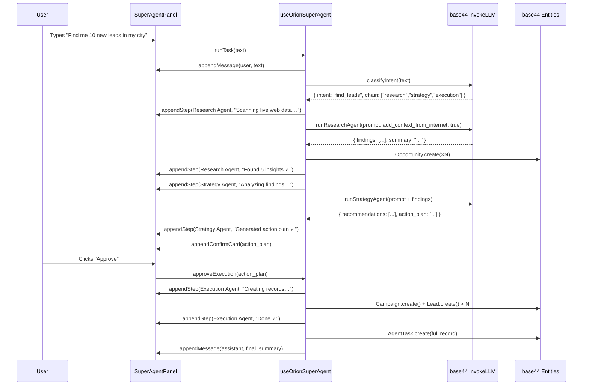
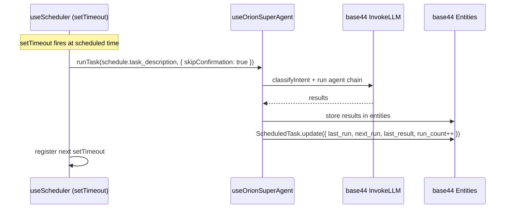
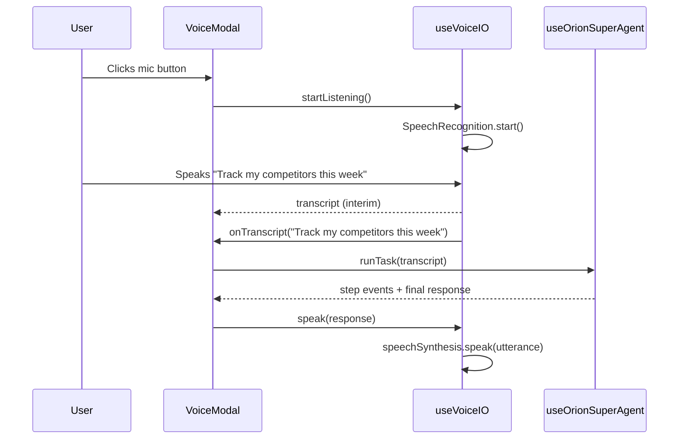

# Design Document: Orion SuperAgent Platform

## Overview

Orion SuperAgent transforms the existing Orion React + Vite app into a conversational AI command center for small business owners. Users type or speak natural language tasks — "Find me 10 new leads", "Track my competitors this week", "Generate a summer campaign" — and a multi-agent system executes them using live web data from Bright Data, streaming real-time progress back to the UI.

The entire platform runs as a pure frontend React application. All AI calls go through `base44.integrations.Core.InvokeLLM` with `add_context_from_internet: true` for live web data. All data persistence uses `base44.entities.*`. Scheduling is implemented with browser-native `setTimeout`/`setInterval` and stored in localStorage + base44 entities. Voice input/output uses the browser Web Speech API. No new backend is required.

This design targets the Bright Data "Web Data UNLOCKED" hackathon — GTM Intelligence track — and the "Best Use of Kiro" partner challenge.

---

## Architecture

### High-Level System Diagram

```
┌─────────────────────────────────────────────────────────────────────┐
│                     React + Vite Frontend                           │
│                                                                     │
│  ┌──────────────┐  ┌──────────────┐  ┌──────────────────────────┐  │
│  │  TopBar      │  │  Sidebar     │  │  AppLayout (Outlet)      │  │
│  │  [Voice Btn] │  │  [Nav Links] │  │                          │  │
│  │  [Ask AI Btn]│  │              │  │  Pages: Dashboard,       │  │
│  └──────┬───────┘  └──────────────┘  │  Intelligence, Agents,  │  │
│         │                            │  Campaigns, Leads,       │  │
│         ▼                            │  Social, Analytics,      │  │
│  ┌──────────────────────────────┐    │  Settings                │  │
│  │  SuperAgentPanel (floating)  │    └──────────────────────────┘  │
│  │  ┌──────────────────────┐    │                                   │
│  │  │  Chat Thread         │    │  ┌────────────────────────────┐  │
│  │  │  [User messages]     │    │  │  VoiceModal (upgraded)     │  │
│  │  │  [Agent steps]       │    │  │  Web Speech API input      │  │
│  │  │  [Result cards]      │    │  │  → SuperAgent routing      │  │
│  │  └──────────────────────┘    │  │  Speech Synthesis output   │  │
│  │  [Task input + Voice btn]    │  └────────────────────────────┘  │
│  └──────────────────────────────┘                                   │
└─────────────────────────────────────────────────────────────────────┘
                              │
                    base44 SDK layer
                              │
          ┌───────────────────┼───────────────────┐
          ▼                   ▼                   ▼
  base44.integrations   base44.entities.*    localStorage
  .Core.InvokeLLM       (Lead, Opportunity,  (ScheduledTask
  (add_context_from_    Campaign, AgentRun,  configs, next
   internet: true)      AgentTask,           run times)
                        ScheduledTask,
                        ChatSession,
                        SocialPost,
                        Business)
```

### Agent Execution Data Flow

```
User Input (text or voice)
        │
        ▼
useOrionSuperAgent hook
        │
        ├─── Intent Classification (InvokeLLM)
        │         → determines: research | strategy | execution | general
        │
        ├─── Research Agent (if needed)
        │         → InvokeLLM + add_context_from_internet: true
        │         → saves Opportunity records
        │         → emits step events to chat thread
        │
        ├─── Strategy Agent (if needed)
        │         → InvokeLLM with business context + research findings
        │         → produces recommendations + action plan
        │         → emits step events to chat thread
        │
        ├─── Execution Agent (if needed)
        │         → shows confirmation card to user
        │         → on approval: creates Campaign / Lead / SocialPost records
        │         → emits step events to chat thread
        │
        └─── Final Summary
                  → saves AgentTask record
                  → renders result cards in chat thread
```

### Component Tree (New Components)

```
src/
├── component/
│   ├── superagent/
│   │   ├── SuperAgentPanel.jsx        ← full-screen chat panel (replaces ChatPanel)
│   │   ├── AgentStepCard.jsx          ← shows one agent thinking step
│   │   ├── AgentResultCard.jsx        ← inline result card (leads found, etc.)
│   │   ├── TaskConfirmCard.jsx        ← "Here's what I'll do — approve?" card
│   │   └── PresetTaskGrid.jsx         ← preset task template buttons
│   ├── agents/
│   │   ├── AgentStatusCard.jsx        ← agent type card with status indicator
│   │   ├── ScheduledTaskRow.jsx       ← one scheduled task with toggle
│   │   └── RunHistoryItem.jsx         ← expandable run history entry
│   ├── intelligence/
│   │   ├── CompetitorTracker.jsx      ← add/monitor competitor URLs
│   │   ├── MarketSignalCard.jsx       ← one market signal with source attribution
│   │   └── LiveScanBanner.jsx         ← "Powered by live web data" banner
│   ├── voice/
│   │   └── VoiceModal.jsx             ← upgraded (routes to SuperAgent)
│   └── layout/
│       ├── Sidebar.jsx                ← add SuperAgent floating button
│       └── TopBar.jsx                 ← existing (no change needed)
├── hooks/
│   ├── useOrionSuperAgent.js          ← core multi-agent orchestration hook
│   ├── useScheduler.js                ← frontend scheduler (localStorage + entities)
│   └── useVoiceIO.js                  ← Web Speech API input + synthesis output
├── pages/
│   ├── Agents.jsx                     ← full rebuild
│   ├── Intelligence.jsx               ← upgrade with live scan + competitor tracker
│   └── Dashboard.jsx                  ← upgrade with SuperAgent activity feed
└── entities/
    ├── ScheduledTask.json             ← new entity
    └── AgentTask.json                 ← new entity
```

---

## Components and Interfaces

### useOrionSuperAgent Hook

**Purpose**: Core orchestration logic. Receives a task string, classifies intent, chains sub-agents, streams step events, and returns final results.

**Interface**:
```javascript
// hooks/useOrionSuperAgent.js

const useOrionSuperAgent = () => {
  // State
  const [messages, setMessages]       // chat thread messages
  const [isRunning, setIsRunning]     // global running flag
  const [currentAgent, setCurrentAgent] // which agent is active

  // Main entry point
  const runTask = async (taskText, options = {}) => {
    // options: { skipConfirmation: false, presetId: null }
    // 1. Append user message to thread
    // 2. Classify intent → determine agent chain
    // 3. Run agents in sequence, emitting step cards
    // 4. If execution needed: emit confirmation card, wait for approval
    // 5. On approval: run execution agent
    // 6. Save AgentTask record
    // 7. Append final summary message
  }

  // Called when user approves a TaskConfirmCard
  const approveExecution = async (pendingActions) => { ... }

  // Called when user rejects a TaskConfirmCard
  const rejectExecution = () => { ... }

  return { messages, isRunning, currentAgent, runTask, approveExecution, rejectExecution }
}
```

**Agent Chain Logic**:
```javascript
// Intent → agent chain mapping
const INTENT_CHAINS = {
  find_leads:          ['research', 'strategy', 'execution'],
  track_competitors:   ['research'],
  generate_campaign:   ['strategy', 'execution'],
  weekly_summary:      ['strategy'],
  brand_mentions:      ['research'],
  general_chat:        ['general'],
}

// Intent classification prompt (sent to InvokeLLM)
// Returns: { intent: string, confidence: number, context: object }
```

### Research Agent Module

**Purpose**: Collects live web intelligence using `add_context_from_internet: true`. Saves findings as Opportunity records.

**Interface**:
```javascript
// hooks/useOrionSuperAgent.js — runResearchAgent()

const runResearchAgent = async ({ task, businessContext, onStep }) => {
  onStep({ agent: 'Research Agent', action: 'Scanning live web data…', status: 'running' })

  const result = await base44.integrations.Core.InvokeLLM({
    prompt: buildResearchPrompt(task, businessContext),
    add_context_from_internet: true,
    response_json_schema: RESEARCH_OUTPUT_SCHEMA,
  })

  // Save each finding as an Opportunity entity
  for (const finding of result.findings) {
    await base44.entities.Opportunity.create({
      business_id: businessContext.id,
      title: finding.title,
      description: finding.description,
      category: finding.category,
      urgency: finding.urgency,
      impact_score: finding.impact_score,
      source: finding.source,        // URL or source name
      suggested_action: finding.suggested_action,
      raw_data: finding.raw_data,
      status: 'new',
    })
  }

  onStep({ agent: 'Research Agent', action: `Found ${result.findings.length} insights`, status: 'complete' })
  return result
}
```

**Research Output Schema**:
```javascript
const RESEARCH_OUTPUT_SCHEMA = {
  type: 'object',
  properties: {
    findings: {
      type: 'array',
      items: {
        type: 'object',
        properties: {
          title:            { type: 'string' },
          description:      { type: 'string' },
          category:         { type: 'string' }, // pricing|competitor|trend|review|gap
          urgency:          { type: 'string' }, // low|medium|high|critical
          impact_score:     { type: 'number' }, // 1-10
          source:           { type: 'string' }, // URL or source name
          suggested_action: { type: 'string' },
          raw_data:         { type: 'string' },
        }
      }
    },
    summary: { type: 'string' },
    data_freshness: { type: 'string' }, // "Live web data as of [date]"
  }
}
```

### Strategy Agent Module

**Purpose**: Reviews business data + research findings, produces prioritized recommendations and an action plan.

**Interface**:
```javascript
const runStrategyAgent = async ({ task, businessContext, researchFindings, onStep }) => {
  onStep({ agent: 'Strategy Agent', action: 'Analyzing business data…', status: 'running' })

  const result = await base44.integrations.Core.InvokeLLM({
    prompt: buildStrategyPrompt(task, businessContext, researchFindings),
    response_json_schema: STRATEGY_OUTPUT_SCHEMA,
  })

  onStep({ agent: 'Strategy Agent', action: `Generated ${result.recommendations.length} recommendations`, status: 'complete' })
  return result
}
```

**Strategy Output Schema**:
```javascript
const STRATEGY_OUTPUT_SCHEMA = {
  type: 'object',
  properties: {
    recommendations: {
      type: 'array',
      items: {
        type: 'object',
        properties: {
          title:       { type: 'string' },
          rationale:   { type: 'string' },
          priority:    { type: 'string' }, // high|medium|low
          effort:      { type: 'string' }, // quick_win|medium|long_term
        }
      }
    },
    action_plan: {
      type: 'array',
      items: {
        type: 'object',
        properties: {
          action_type:  { type: 'string' }, // create_campaign|draft_post|update_lead|schedule_followup
          description:  { type: 'string' },
          entity_data:  { type: 'object' }, // data to pass to execution agent
        }
      }
    },
    summary: { type: 'string' },
  }
}
```

### Execution Agent Module

**Purpose**: Turns approved action plan items into actual base44 entity records. Shows a confirmation step before executing.

**Interface**:
```javascript
const runExecutionAgent = async ({ actions, businessContext, onStep }) => {
  const results = []

  for (const action of actions) {
    onStep({ agent: 'Execution Agent', action: `Creating ${action.action_type}…`, status: 'running' })

    if (action.action_type === 'create_campaign') {
      const campaign = await base44.entities.Campaign.create({
        business_id: businessContext.id,
        ai_generated: true,
        status: 'draft',
        ...action.entity_data,
      })
      results.push({ type: 'campaign', record: campaign })
    }

    if (action.action_type === 'draft_post') {
      const post = await base44.entities.SocialPost.create({
        business_id: businessContext.id,
        ai_generated: true,
        status: 'draft',
        ...action.entity_data,
      })
      results.push({ type: 'social_post', record: post })
    }

    if (action.action_type === 'create_lead') {
      const lead = await base44.entities.Lead.create({
        business_id: businessContext.id,
        source: 'other',
        status: 'new',
        ...action.entity_data,
      })
      results.push({ type: 'lead', record: lead })
    }

    onStep({ agent: 'Execution Agent', action: `Created ${action.action_type}`, status: 'complete' })
  }

  return results
}
```

### useScheduler Hook

**Purpose**: Frontend-based scheduler using `setTimeout`/`setInterval` with cron-like logic. Persists schedule configs to localStorage and `ScheduledTask` entities.

**Interface**:
```javascript
// hooks/useScheduler.js

const useScheduler = () => {
  const schedules = []          // loaded from localStorage + entities

  const createSchedule = async (config) => {
    // config: { name, task_description, frequency, day_of_week, time_of_day, business_id }
    // 1. Save to base44.entities.ScheduledTask
    // 2. Save to localStorage for persistence across page loads
    // 3. Register setTimeout for next run
  }

  const toggleSchedule = async (scheduleId, enabled) => { ... }
  const deleteSchedule = async (scheduleId) => { ... }
  const getNextRunTime = (schedule) => { ... }  // returns Date object

  return { schedules, createSchedule, toggleSchedule, deleteSchedule }
}
```

**Scheduling Logic**:
```javascript
// Calculate ms until next run
const msUntilNextRun = (schedule) => {
  const now = new Date()
  const [hours, minutes] = schedule.time_of_day.split(':').map(Number)

  if (schedule.frequency === 'daily') {
    const next = new Date(now)
    next.setHours(hours, minutes, 0, 0)
    if (next <= now) next.setDate(next.getDate() + 1)
    return next - now
  }

  if (schedule.frequency === 'weekly') {
    const dayMap = { monday: 1, tuesday: 2, wednesday: 3, thursday: 4,
                     friday: 5, saturday: 6, sunday: 0 }
    const targetDay = dayMap[schedule.day_of_week]
    const next = new Date(now)
    next.setHours(hours, minutes, 0, 0)
    const daysUntil = (targetDay - now.getDay() + 7) % 7 || 7
    next.setDate(next.getDate() + daysUntil)
    return next - now
  }
}
```

### useVoiceIO Hook

**Purpose**: Wraps Web Speech API for voice input and Speech Synthesis for voice output. Routes transcribed text to SuperAgent.

**Interface**:
```javascript
// hooks/useVoiceIO.js

const useVoiceIO = ({ onTranscript }) => {
  const [isListening, setIsListening]
  const [transcript, setTranscript]
  const [isSpeaking, setIsSpeaking]

  const startListening = () => {
    // Uses window.SpeechRecognition || window.webkitSpeechRecognition
    // Sets continuous: false, interimResults: true
    // On final result: calls onTranscript(text)
  }

  const stopListening = () => { recognition.stop() }

  const speak = (text) => {
    // Uses window.speechSynthesis.speak()
    // Strips markdown before speaking
    // Sets rate: 1.0, pitch: 1.0
  }

  const cancelSpeech = () => { window.speechSynthesis.cancel() }

  return { isListening, transcript, isSpeaking, startListening, stopListening, speak, cancelSpeech }
}
```

---

## Data Models

### New Entity: ScheduledTask

```json
{
  "name": "ScheduledTask",
  "type": "object",
  "properties": {
    "business_id":       { "type": "string" },
    "name":              { "type": "string" },
    "task_description":  { "type": "string" },
    "frequency": {
      "type": "string",
      "enum": ["daily", "weekly", "monthly"]
    },
    "day_of_week": {
      "type": "string",
      "enum": ["monday", "tuesday", "wednesday", "thursday", "friday", "saturday", "sunday"]
    },
    "time_of_day":  { "type": "string" },
    "enabled":      { "type": "boolean", "default": true },
    "last_run":     { "type": "string", "format": "date-time" },
    "next_run":     { "type": "string", "format": "date-time" },
    "last_result":  { "type": "string" },
    "run_count":    { "type": "number", "default": 0 }
  },
  "required": ["business_id", "name", "task_description", "frequency", "time_of_day"]
}
```

### New Entity: AgentTask

```json
{
  "name": "AgentTask",
  "type": "object",
  "properties": {
    "business_id":  { "type": "string" },
    "session_id":   { "type": "string" },
    "task":         { "type": "string" },
    "agent_chain": {
      "type": "array",
      "items": { "type": "string" }
    },
    "status": {
      "type": "string",
      "enum": ["running", "awaiting_approval", "completed", "rejected", "failed"],
      "default": "running"
    },
    "steps": {
      "type": "array",
      "items": {
        "type": "object",
        "properties": {
          "agent":   { "type": "string" },
          "action":  { "type": "string" },
          "result":  { "type": "string" },
          "status":  { "type": "string" }
        }
      }
    },
    "final_summary": { "type": "string" },
    "records_created": {
      "type": "array",
      "items": {
        "type": "object",
        "properties": {
          "entity_type": { "type": "string" },
          "entity_id":   { "type": "string" },
          "description": { "type": "string" }
        }
      }
    }
  },
  "required": ["business_id", "task"]
}
```

### Extended AgentRun Entity (additions)

The existing `AgentRun` entity is extended with:
- `agent_type` enum: add `"superagent"`, `"research"`, `"strategy"`, `"execution"`
- `streaming_log`: `array of string` — step-by-step log for replay in UI
- `schedule_id`: `string` — links to ScheduledTask if triggered by scheduler
- `agent_task_id`: `string` — links to AgentTask record

---

## Sequence Diagrams

### SuperAgent Chat: Full Multi-Agent Run



### Scheduled Task Trigger



### Voice Input Flow



---

## Error Handling

### LLM Call Failure

**Condition**: `base44.integrations.Core.InvokeLLM` throws or returns null.
**Response**: The agent step emits an error card in the chat thread with a user-friendly message. The AgentTask is saved with `status: "failed"`.
**Recovery**: User can retry the task. Partial results already saved to entities are preserved.

### JSON Schema Parse Failure

**Condition**: LLM returns a response that doesn't match the expected JSON schema.
**Response**: The hook catches the parse error, falls back to treating the response as plain text, and renders it as a text message instead of a structured card.
**Recovery**: The agent chain continues with degraded output where possible.

### Voice API Unavailable

**Condition**: `window.SpeechRecognition` is undefined (non-Chrome browser).
**Response**: The voice button shows a tooltip: "Voice requires Chrome or Edge". The mic button is disabled.
**Recovery**: User can type instead. All functionality remains available via text input.

### Scheduler Missed Run (Page Closed)

**Condition**: User closes the browser tab before a scheduled task fires.
**Response**: On next page load, `useScheduler` checks `last_run` vs `next_run` for all enabled schedules. If `next_run` is in the past, it fires the task immediately on mount.
**Recovery**: The task runs once on page load, then re-registers the next `setTimeout`.

### Execution Agent Rejected

**Condition**: User clicks "Reject" on a TaskConfirmCard.
**Response**: The execution agent is skipped. The AgentTask is saved with `status: "rejected"`. A message is appended: "Got it — no changes were made."
**Recovery**: Research and strategy results are still saved. User can ask for a modified plan.

---

## Testing Strategy

### Unit Testing Approach

- Test `useOrionSuperAgent` hook with mocked `base44` calls
- Test intent classification logic with representative task strings
- Test `useScheduler` timing calculations with fixed Date mocks
- Test `useVoiceIO` with mocked `SpeechRecognition` and `speechSynthesis`

### Property-Based Testing Approach

**Property Test Library**: fast-check

### Integration Testing Approach

- Test full agent chain with mocked LLM responses
- Test entity creation side effects (verify correct fields saved)
- Test scheduler registration and cancellation

---

## Performance Considerations

- Agent chains run sequentially (not parallel) to keep the UI step-by-step narrative clear
- LLM calls use `response_json_schema` to reduce token usage and parsing overhead
- Chat thread messages are stored in React state only (not persisted per message) — only the final AgentTask record is saved to base44
- Scheduler uses a single `setTimeout` per schedule (not `setInterval`) to avoid drift; each run re-registers the next timeout
- The SuperAgentPanel is rendered once in AppLayout and toggled via CSS visibility, not unmounted, to preserve chat history across page navigation

---

## Security Considerations

- All `business_id` values come from the authenticated base44 session — never from user input
- LLM prompts include explicit instructions to not reveal system prompt details
- Execution Agent only creates records in the user's own business context
- Scheduled tasks are stored in localStorage keyed by `business_id` to prevent cross-user leakage
- Voice transcripts are processed in-browser via Web Speech API — no audio data leaves the browser

---

## Dependencies

All dependencies already present in the project:

| Package | Already in project | Purpose |
|---|---|---|
| `@base44/sdk` | ✅ | LLM calls + entity CRUD |
| `react` 18 | ✅ | UI framework |
| `framer-motion` | ✅ | Animations for step cards |
| `lucide-react` | ✅ | Icons |
| `react-markdown` | ✅ | Render LLM markdown responses |
| `recharts` | ✅ | Dashboard charts |
| Web Speech API | ✅ (browser) | Voice input/output |

No new npm packages required.

---

## Correctness Properties

*A property is a characteristic or behavior that should hold true across all valid executions of a system — essentially, a formal statement about what the system should do. Properties serve as the bridge between human-readable specifications and machine-verifiable correctness guarantees.*

### Property 1: Intent classification precedes agent execution

*For any* task string submitted to the SuperAgent, the intent classification step must complete and produce an agent chain before any sub-agent (Research, Strategy, or Execution) is invoked.

**Validates: Requirements 1.3**

### Property 2: Agent step completeness

*For any* agent chain of length N, every agent in the chain must emit at least one step event (with agent name, action text, and status) before the task is marked complete.

**Validates: Requirements 1.4, 2.4, 3.3, 4.4**

### Property 3: AgentTask record completeness

*For any* completed agent task (status = "completed"), the saved AgentTask record must contain: a non-empty `task` string, a non-empty `agent_chain` array with at least one entry, at least one entry in `steps`, and a non-empty `final_summary`.

**Validates: Requirements 1.5**

### Property 4: Research Agent always uses live web data

*For any* invocation of the Research Agent, the InvokeLLM call must include `add_context_from_internet: true` — no Research Agent call may omit this flag.

**Validates: Requirements 2.1, 11.1**

### Property 5: Research findings persistence count

*For any* successful Research Agent run that returns N findings (N > 0), exactly N Opportunity records must be created in base44, each with a non-empty `source` field, `status: "new"`, and all required fields (`title`, `description`, `category`, `urgency`, `impact_score`, `suggested_action`).

**Validates: Requirements 2.2, 2.3**

### Property 6: Execution approval gate

*For any* agent task that includes an execution step, zero entity records may be created in base44 before the user has explicitly clicked "Approve" on the TaskConfirmCard. If the user clicks "Reject", the final record count created by that execution step must be zero.

**Validates: Requirements 4.1, 4.2, 4.3**

### Property 7: Execution Agent record field invariants

*For any* Campaign record created by the Execution Agent, `ai_generated` must be `true` and `status` must be `"draft"`. *For any* Lead record created by the Execution Agent, `source` must be `"other"` and `status` must be `"new"`.

**Validates: Requirements 4.5, 4.6**

### Property 8: Scheduler persistence completeness

*For any* ScheduledTask created via the Scheduler, all three of the following must occur: a `setTimeout` is registered for the next run time, the configuration is written to localStorage, and a base44 ScheduledTask entity is created with matching fields.

**Validates: Requirements 5.1**

### Property 9: Scheduler next-run monotonicity

*For any* enabled ScheduledTask after a completed execution cycle, `next_run` must be strictly greater than `last_run`, and `run_count` must equal the previous `run_count` plus one.

**Validates: Requirements 5.3**

### Property 10: Scheduled task missed-run recovery

*For any* enabled ScheduledTask where `next_run` is in the past at page load time, the task must be triggered exactly once during the mount cycle — not zero times and not more than once.

**Validates: Requirements 5.4**

### Property 11: Scheduled task runs without confirmation

*For any* task triggered by the Scheduler (not by direct user input), the SuperAgent must be invoked with `skipConfirmation: true`, meaning no TaskConfirmCard is shown and execution proceeds automatically.

**Validates: Requirements 5.2**

### Property 12: Voice transcript verbatim pass-through

*For any* non-empty voice transcript produced by the Web Speech API, the exact transcript string must be passed to `runTask` without any modification, trimming beyond leading/trailing whitespace, or transformation.

**Validates: Requirements 8.2**

### Property 13: Bright Data attribution rendering

*For any* result card rendered from a Research Agent run, the card must display the "Powered by live web data" attribution label. *For any* AgentStepCard rendered for a Research Agent step, the action text must reference Bright Data.

**Validates: Requirements 7.3, 11.2, 11.4**
